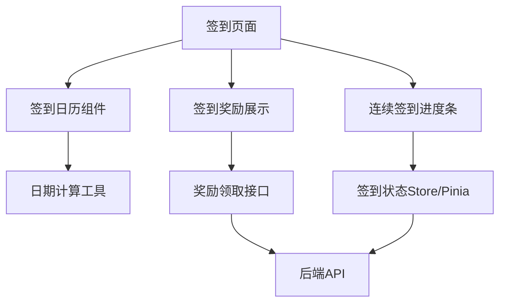

# 中期报告写作示例

> 以下示例基于多项目实习场景（前端实习生同时参与3-4个项目），需替换为用户真实经历。

---

## 1.1 实习工作完成情况 示例

> ❌ 错误写法（AI化痕迹重）

"在过去的几个月里，我积极投入到了多个项目的开发工作中，取得了显著的进步。首先，我完成了年度报告H5模块的开发，这极大地提高了团队的工作效率。其次，我还参与了小程序的开发工作，深入学习了跨平台开发技术。"

> ✅ 正确写法（客观、具体、有数据）

"实习至今已满四个半月，工作覆盖四个项目。在广告投放管理平台（ad-serving-manager-web）中，年度报告H5模块已完成全部12个页面组件的开发和联调，包括GSAP动画序列、截图分享功能，目前处于线上运行状态。在次神圈小程序（uni-topgod）中，签到、兑换等模块均已上线，整个小程序初版由笔者独立开发完成。在亿创AI素材生成平台（matrix-number）中，画布工作流的基础架构搭建和多模态模型接入已完成核心功能开发。"

---

## 1.3 职业素养学习培养 示例

> ❌ 错误写法

"通过实习，我深刻认识到了职业素养的重要性，我将在今后的工作中更加注重代码质量。"

> ✅ 正确写法

"在代码质量方面，项目组采用 ESLint + Prettier 统一代码风格，所有合并请求需经过至少一位同事的 Code Review 后方可合入主分支。在一次代码评审中，评审人指出某组件未对用户输入进行XSS过滤，随后引入 DOMPurify 库对富文本内容进行清洗，该修改防止了潜在的跨站脚本攻击。此事促使笔者在后续开发中对所有涉及动态HTML渲染的场景均增加了安全处理。"

---

## 2.x 需求分析 示例

> 项目：亿创AI素材生成平台 - 画布工作流模块

**功能需求**：

画布工作流模块为用户提供可视化的AI模型编排能力，用户通过拖拽节点、连接连线的方式构建模型推理流程。具体功能需求如下：

1. **节点管理**：支持从节点面板拖拽创建节点，包括输入节点、模型节点、输出节点、条件节点等类型，每种节点具有独立的配置面板。
2. **连线管理**：节点间通过端口连接，系统自动校验连线的合法性（如输出端口只能连接到输入端口）。
3. **多模态模型接入**：支持文本、图像、音频等多种模态的模型调用，用户可在模型节点中选择具体的模型类型和参数配置。

如图2-x所示为画布工作流模块的功能结构图。

**性能需求**：

| 指标 | 要求 |
|------|------|
| 画布节点数量 | 支持≥50个节点的流畅渲染 |
| 拖拽响应延迟 | ≤16ms（60fps） |
| 工作流保存时间 | ≤2s |

---

## 3.3 应用软件设计与实现 示例

> 项目：小程序签到模块

该模块基于 UniApp 3 框架开发，采用 Vue 3 Composition API + TypeScript 的技术组合。如图3-x所示为签到模块的技术架构。



签到功能的核心逻辑包含三部分：日历状态渲染、签到请求处理、连续签到奖励计算。以签到请求处理为例，关键代码如下：

```typescript
const handleSignIn = async () => {
  if (signInState.todaySigned) return
  try {
    const res = await signInApi.doSignIn({ userId: userStore.userId })
    signInState.todaySigned = true
    signInState.continuousDays = res.continuousDays
    // 触发奖励弹窗
    if (res.reward) {
      showRewardPopup(res.reward)
    }
  } catch (error) {
    uni.showToast({ title: '签到失败，请重试', icon: 'none' })
  }
}
```

---

## 4.1 存在的主要问题 示例

> ❌ 错误写法

"开发过程中遇到了很多困难，但我都一一克服了，这让我成长了很多。"

> ✅ 正确写法

"**问题一：多项目并行的时间管理**

实习中期同时参与三个项目的迭代开发，每个项目的排期和优先级不同。以2026年3月为例，小程序需要在月中完成签到功能的上线，同时AI平台的画布工作流处于核心架构搭建阶段。两个项目的交付节点相隔不到一周，导致开发时间冲突。

应对措施：与导师沟通后，按照业务优先级将小程序签到功能排在首位（因其直接面向终端用户），画布工作流的需求拆解为最小可用版本先行交付，非核心功能延后至下一迭代。通过此次经历，建立了按周维度的工作日志，提前识别时间冲突并主动与项目负责人协调排期。"

---

## 5.1 前期任务完成度 示例

**项目一：广告投放管理平台**

| 任务 | 状态 | 完成度 |
|------|------|--------|
| 年度报告H5模块 | 已完成 | 100% |
| GSAP页面切换动画 | 已完成 | 100% |
| 截图分享功能 | 已完成 | 100% |
| 数据维度解析规则 | 进行中 | 60% |

项目完成度：**90%**

**项目二：途游棋牌小程序**

| 任务 | 状态 | 完成度 |
|------|------|--------|
| 签到功能 | 已完成 | 100% |
| 兑换功能 | 已完成 | 100% |
| 其他页面开发 | 已完成 | 100% |

项目完成度：**100%**

**总体完成度：约 85%**

---

## 参考文献引用 示例

正文中：

"...本项目采用 Vue 3[1] 框架进行开发，使用 TypeScript[2] 作为开发语言。在动画实现方面，选用 GSAP[3] 库实现页面切换的过渡效果..."

文末参考文献列表：

[1] Vue.js Team. Vue.js - The Progressive JavaScript Framework[EB/OL]. https://vuejs.org/, 2024-01-15
[2] Microsoft. TypeScript: JavaScript With Syntax For Types[EB/OL]. https://www.typescriptlang.org/, 2024-01-15
[3] GreenSock. GSAP - Professional-Grade Animation for the Modern Web[EB/OL]. https://gsap.com/, 2024-01-15
